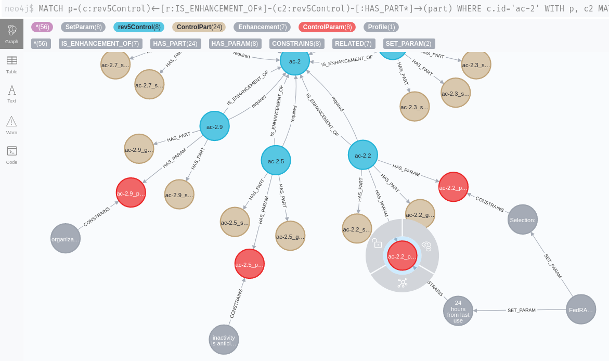

# OSCAL Content for Neo4J

This repository features scripts written in the Cypher query language that can be used to import control catalogs and other data represented in the OSCAL format into a Neo4J graph database. 

You will need the APOC library to scrape them directly from Github into the database. There is no need to download the files first.

For further background information on these scripts you may want to watch this presentation: 

[YouTube: OSCAL4Neo4j](https://youtu.be/FVCFmSIsYic)

The slides from this presentation are available [here](https://www.slideshare.net/neo4j/cybersecurity-automation-with-oscal-and-neo4j)

## OSCAL: NIST 800-53 rev5 
### Now also including SP 800-53A (Assessment Layer)

In the data directory you will find a set of Neo4J cypher commands. They will scrape the [OSCAL](https://github.com/usnistgov/OSCAL) representation 
of the [NIST 800-53](https://github.com/usnistgov/oscal-content) catalog layer directly from Github 
into the Neo4J database.

There are also scripts to scrape the [FedRAMP and NIST profiles](https://pages.nist.gov/OSCAL/documentation/schema/) (LOW, MEDIUM, HIGH and PRIVACY profiles). These will be linked to the catalog layer nodes so make sure to import these first.

### **Examples:**

### *The control 'AC-2' with its enhancements and parts:*

### *Relations between controls:*

### *Tabular output: which controls are most required by other controls:*

### *Example: referenced backmatter:*

### *A withdrawn control (the loop on sc-12 was confirmed by @usnistgov to [probably be an error in the FISMA source](https://github.com/usnistgov/oscal-content/issues/72)):*

## Assessments (NIST SP 800-53A)

### A query shows the assessment-objective as well as assessment-methods (i.e. "examine", "test", "interview) for the control AC-2.1. 

### Also included are the assessment-objects which should be examined as well as the required interview-partners:

### Assessment-methods visualized as graph:

### Listing all required interview-partners for the entire control family AC (access control):

 
 
 ### Opposite view: listing all controls that can be interviewed with one distinct set of interview-partners over all control families:

 

## OSCAL: FedRAMP profiles (rev4)

These scripts will scrape the [FedRAMP](https://github.com/GSA/fedramp-automation) profiles (LOW, MEDIUM, HIGH) form the Github repository directly into Neo4J. They will be linked to the previously imported 800-53 controls and control enhancements
so make sure that you have imported them first.

### *Example: query all controls in family IA for the LOW profile:*

### *Example: a FedRAMP profile can constrain control parameters to specific values*

Here a time range parameter of control enhancement AV-2.2 is constrained to a value of "24 hours from last use". 

This applies to the second parameter of this statement: "Automatically {{ remove / disable }} temporary and emergency accounts after {{ organization-defined time period for each type of account }}.

### *A FedRAMP profile can add parameters and parts to controls*

Here: additional requirements and guidance are added to control RA-5.6:

### The FedRAMP 'HIGH' profile puts more strict constraints on control parameters than the FedRAMP 'MODERATE' profile:

## Other sources

There are other publicly available Neo4J databases that can be included as well, such as the graph from the [SCKG](https://gitlab.com/redteam-project/sckg) project.

Combining such sources with the OSCAL imports can enable additional use cases such as compliance mappings between different standards. For instance, assessment results from an OSCAL model can be used to deduce compliance with certain topics from the perspective of a PCI DSS assessor.

SCKG doesn't model all of the standards in the greatest depth (i.e. control enhancements, properties, parts won't be differentiated for 800-53) but it makes up for that by including a lot of standards.

### *Compliance Mapping: a connection from PCI DSS to ISO/IEC 27001:2013 was found by the "shortestPath" algorithm using a NIST CSF control as an intermediary*

This is accomplished by using the [SCKG](https://gitlab.com/redteam-project/sckg) graph.

We can deduce that there is an analogy between the ISO 27001 control A.14.2.8 ("System Security Testing") and the PCI DSS controls 11.4 ("Use intrusion detection and prevention") and 11.5 ("Deploy a change detection mechanism"):

### *SCKG: A shortest-path connection between Cobit 5 APO-012.02 ("Analyse risk") and NIST 800-53rev4 PM-16 ("Threat awareness program") , again using a NIST CSF control as an intermediary*

## Schema Visualization

The complete database schema currently looks as follows (this includes nodes from [SCKG](https://gitlab.com/redteam-project/sckg), see above):

# Copyright notice

This project is not endorsed by or affiliated with NIST.gov. For official publications please go to [https://github.com/usnistgov](https://github.com/usnistgov).

This project is copyrighted under a [CC BY-NC 4.0 license](https://creativecommons.org/licenses/by-nc/4.0/).

## Original OSCAL copyright:
"Open source work by the U.S. government that is in the public domain contributed under the National Institute of Standards and Technology License.
Open source work contributed by members of the public based on the CC0
1.0 Universal license."

## Original OSCAL Content copyright:
"As a work of the United States government, this project is in the
public domain within the United States under the National Institute of
Standards and Technology License. Additionally, we waive copyright and
related rights in the work worldwide through the CC0 1.0 Universal
public domain dedication."

